# 1. Project Overview and Scope

This project aims to analyze the operational performance and passenger traffic trends across all civil airports in Turkey from 2018 to 2025. Instead of focusing only on a single city, this study will examine the entire national aviation network. The scope includes identifying growth patterns in different regions, analyzing the seasonality of tourism-based airports (such as Antalya and Dalaman), and measuring the efficiency of regional airports compared to major hubs like Istanbul (IST) and Ankara (ESB).

**Objectives:**

-   To benchmark airport efficiency using "Passenger/Flight" ratios.

-   To analyze the seasonal sensitivity of regional vs. hub airports.

-   To visualize the geographical distribution of air traffic growth.

# 2. Data

## 2.1 Data Source

The dataset is retrieved from the official statistics of the **General Directorate of State Airports Authority (DHMİ)**.

-   *Reference:* DHMİ Statistics [dhmi.gov.tr/Pages/Statistics.aspx](https://www.dhmi.gov.tr/Sayfalar/Istatistikler.aspx)

## 2.2 General Information About Data

The dataset includes monthly and yearly reports for more than 50 airports. Key variables to be analyzed are:

-   Passenger Numbers: Total counts for domestic and international flights.

-   Flight Movements: The number of commercial and non-commercial aircraft taking off and landing.

-   Cargo and Freight: The volume of air cargo handled, which reflects the economic activity of the region. The data allows for a longitudinal study, covering the period before, during, and after the global pandemic.

## 2.3 Reason of Choice

Analyzing the full national dataset is essential for a complete understanding of Turkey's logistics and transportation infrastructure. This choice allows for benchmarking (comparing different airports) to see which ones are operating at high efficiency and which ones have underutilized capacity. From an Industrial Engineering perspective, this wide-scale data enables the use of clustering techniques to group airports by their traffic behavior and forecasting models to predict future demand across different regions of Turkey.

## 2.4 Preprocessing

The raw Excel files were loaded year by year for the 2018--2025 period. Each yearly file includes the same main sheets: passenger, commercial aircraft movements, all aircraft movements, freight, and cargo. After importing the files, a `year` column was added to each table, and the yearly tables were combined into five main datasets.

Several preprocessing steps were applied:

-   Missing numeric values were replaced with zero because some airports have no activity in specific years or categories.
-   The passenger, cargo, freight, commercial flight, and all-plane movement datasets were separately combined for the 2018--2025 period.
-   Airport names were cleaned before joining the traffic data with coordinate data. Symbols such as `(*)` and minor spelling differences were handled.
-   Province names were extracted from airport names in order to match airport traffic with population data.
-   Coordinate data were used to create spatial visualizations of airports.
-   Province-level population data were used to calculate passenger traffic per 1,000 residents.
-   For all national totals, the `Toplam` column was used directly. This is important because summing `İç Hat`, `Dış Hat`, and `Toplam` together would double-count the traffic.

A basic consistency check was also conducted by comparing whether domestic traffic plus international traffic equals total traffic. This step helped verify that the passenger data structure is reliable for the analysis.

# 3. Analysis

The analysis focuses on four main questions:

1.  How did Turkey's aviation network recover after COVID-19?
2.  Is passenger traffic concentrated in a few major airports?
3.  Which airports have high passenger traffic relative to local population?
4.  Which airports have special roles such as tourism orientation, logistics orientation, or extraordinary emergency-related activity?

## 3.1 Exploratory Data Analysis

The first exploratory analysis examines the largest airports by total passenger traffic in 2025.

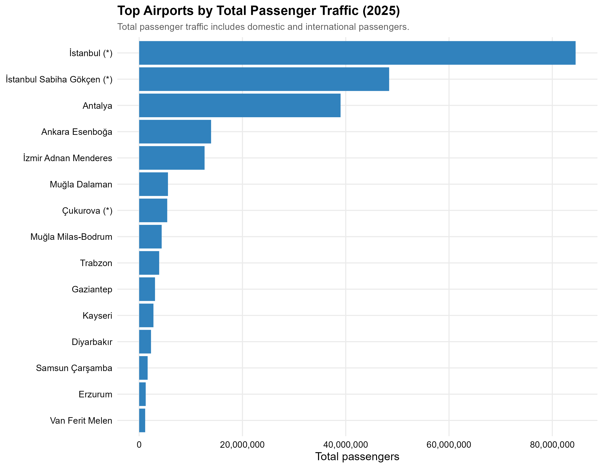{#fig-top-total width="95%"}

In 2025, Istanbul Airport is the largest airport by total passenger traffic. It is followed by Istanbul Sabiha Gökçen and Antalya. Ankara Esenboğa and İzmir Adnan Menderes are also important airports, but their passenger volumes are much lower than the top three. This shows that the Turkish aviation network is geographically broad, but passenger demand is heavily concentrated in a small number of major airports.

<details>

<summary>Show R code for this plot</summary>

``` r
top_passenger <- passenger_2025 |>
  filter(total > 0) |>
  arrange(desc(total)) |>
  slice_head(n = 15)

p_top_passenger <- ggplot(
  top_passenger,
  aes(x = reorder(airport, total), y = total)
) +
  geom_col(fill = "#3182bd") +
  coord_flip() +
  scale_y_continuous(labels = comma) +
  labs(
    title = "Top Airports by Total Passenger Traffic (2025)",
    subtitle = "Total passenger traffic includes domestic and international passengers.",
    x = NULL,
    y = "Total passengers"
  )

ggsave(
  "results/plot_06_top_airports_total_passenger_2025.png",
  p_top_passenger,
  width = 9,
  height = 7,
  dpi = 300
)
```

</details>

The domestic and international composition of the top airports gives additional insight into airport roles.

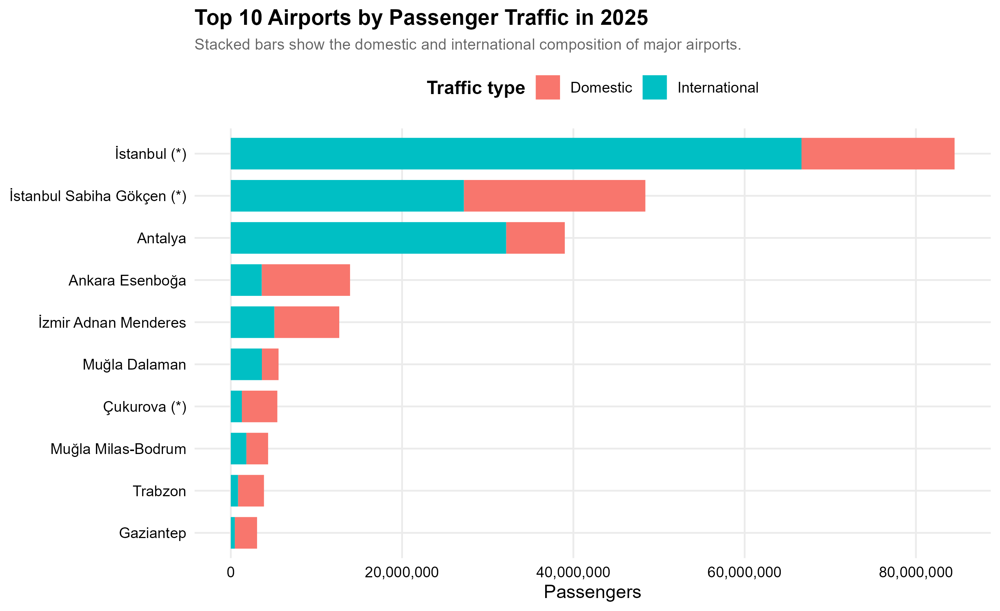{#fig-top10-mix width="95%"}

The passenger mix shows that Istanbul Airport and Antalya have a very strong international passenger component. This is expected because Istanbul is a global hub and Antalya is one of the main tourism destinations in Turkey. In contrast, Ankara Esenboğa and several regional airports are more domestic-oriented.

<details>

<summary>Show R code for this plot</summary>

``` r
top10_mix <- df_passenger |>
  filter(year == 2025) |>
  rename(
    airport = 1,
    domestic = 2,
    international = 3,
    total = 4
  ) |>
  filter(total > 0) |>
  arrange(desc(total)) |>
  slice_head(n = 10) |>
  select(airport, domestic, international) |>
  tidyr::pivot_longer(
    cols = c(domestic, international),
    names_to = "traffic_type",
    values_to = "passengers"
  ) |>
  mutate(
    traffic_type = recode(
      traffic_type,
      domestic = "Domestic",
      international = "International"
    )
  )

p_top10_mix <- ggplot(
  top10_mix,
  aes(x = reorder(airport, passengers), y = passengers, fill = traffic_type)
) +
  geom_col() +
  coord_flip() +
  scale_y_continuous(labels = comma) +
  labs(
    title = "Top 10 Airports by Passenger Traffic in 2025",
    subtitle = "Stacked bars show the domestic and international composition of major airports.",
    x = NULL,
    y = "Passengers",
    fill = "Traffic type"
  )

ggsave(
  "results/03_top10_airports_2025_passenger_mix.png",
  p_top10_mix,
  width = 10,
  height = 7,
  dpi = 300
)
```

</details>

The geographical distribution of airports was also visualized by using airport coordinate data.

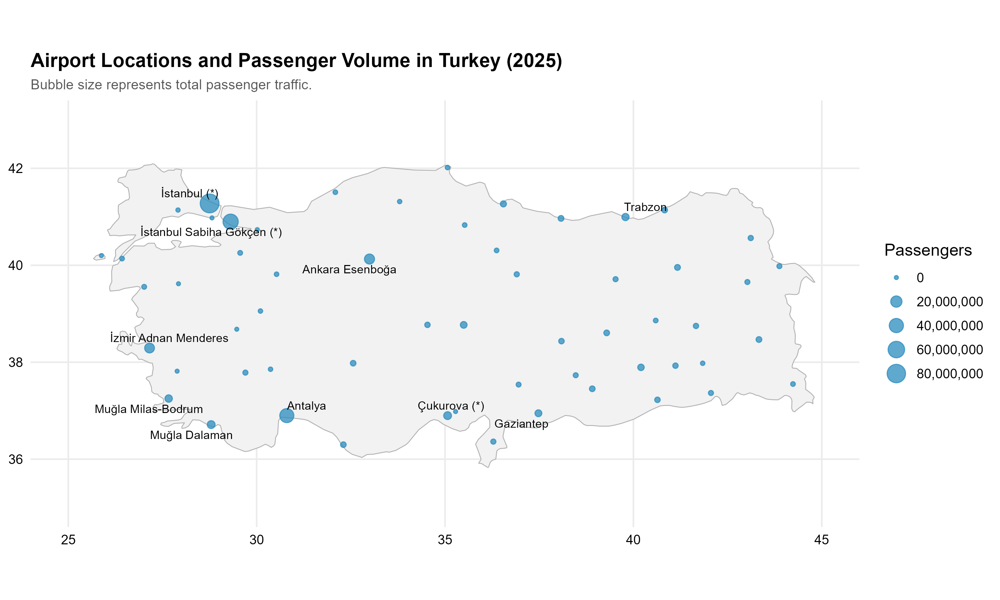{#fig-airport-map width="95%"}

The map shows that large passenger volumes are concentrated around Istanbul, Antalya, Ankara, İzmir, and the southwest tourism corridor. Many regional airports exist across the country, but their traffic volumes are much smaller compared with the major hubs and tourism airports.

<details>

<summary>Show R code for this plot</summary>

``` r
turkey_map <- map_data("world", region = "Turkey")

p_airport_map <- ggplot() +
  geom_polygon(
    data = turkey_map,
    aes(x = long, y = lat, group = group),
    fill = "gray95",
    color = "gray70",
    linewidth = 0.3
  ) +
  geom_point(
    data = map_df |> filter(!is.na(lat), !is.na(lon)),
    aes(x = lon, y = lat, size = total),
    color = "#2b8cbe",
    alpha = 0.75
  ) +
  geom_text_repel(
    data = map_df |>
      filter(!is.na(lat), !is.na(lon)) |>
      slice_max(total, n = 10),
    aes(x = lon, y = lat, label = airport),
    size = 3,
    max.overlaps = 20
  ) +
  scale_size_continuous(labels = comma) +
  coord_quickmap(xlim = c(25, 45), ylim = c(35, 43)) +
  labs(
    title = "Airport Locations and Passenger Volume in Turkey (2025)",
    subtitle = "Bubble size represents total passenger traffic.",
    x = NULL,
    y = NULL,
    size = "Passengers"
  )

ggsave(
  "results/plot_01_airport_locations_passenger_volume_2025.png",
  p_airport_map,
  width = 10,
  height = 6,
  dpi = 300
)
```

</details>

## 3.2 Trend Analysis

The recovery index compares different aviation activities by setting 2019 equal to 100. This makes it possible to compare variables with different units on the same graph.

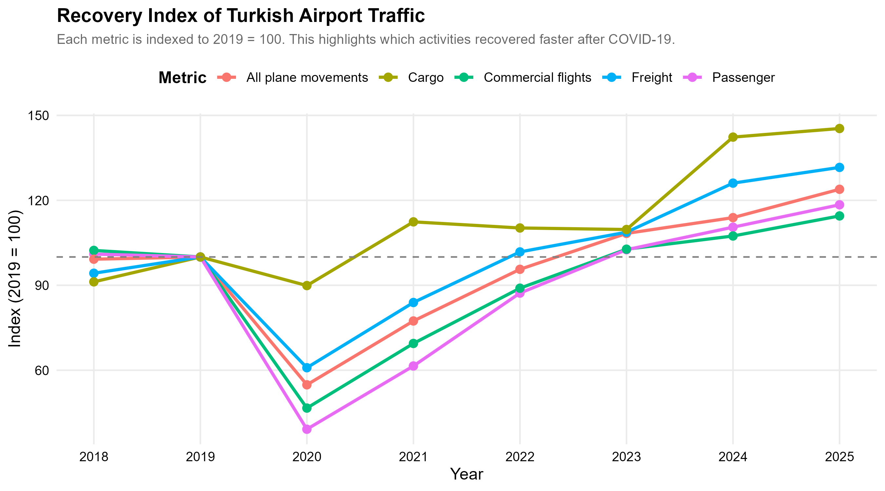{#fig-recovery width="95%"}

The recovery index clearly shows the effect of COVID-19. Passenger traffic and commercial flights decreased sharply in 2020. Cargo traffic, however, was more stable during the same period. By 2025, passenger traffic, cargo, freight, commercial flights, and all-plane movements had all exceeded the 2019 baseline. Cargo shows the strongest increase, indicating that air cargo activity was more resilient during the pandemic and expanded strongly afterward.

<details>

<summary>Show R code for this plot</summary>

``` r
national_totals <- function(df, metric_name) {
  df |>
    rename(total = 4) |>
    group_by(year) |>
    summarise(value = sum(total, na.rm = TRUE), .groups = "drop") |>
    mutate(metric = metric_name)
}

recovery_data <- bind_rows(
  national_totals(df_passenger, "Passenger"),
  national_totals(df_cargo, "Cargo"),
  national_totals(df_freight, "Freight"),
  national_totals(df_commercial, "Commercial flights"),
  national_totals(df_all_plane, "All plane movements")
) |>
  group_by(metric) |>
  mutate(index_2019 = value / value[year == 2019] * 100) |>
  ungroup()

p_recovery <- ggplot(
  recovery_data,
  aes(x = year, y = index_2019, color = metric)
) +
  geom_line(linewidth = 1.2) +
  geom_point(size = 3) +
  geom_hline(yintercept = 100, linetype = "dashed", color = "gray40") +
  scale_x_continuous(breaks = 2018:2025) +
  labs(
    title = "Recovery Index of Turkish Airport Traffic",
    subtitle = "Each metric is indexed to 2019 = 100.",
    x = "Year",
    y = "Index (2019 = 100)",
    color = "Metric"
  )

ggsave(
  "results/01_recovery_index_all_metrics.png",
  p_recovery,
  width = 10,
  height = 6,
  dpi = 300
)
```

</details>

The international passenger share also changed over time.

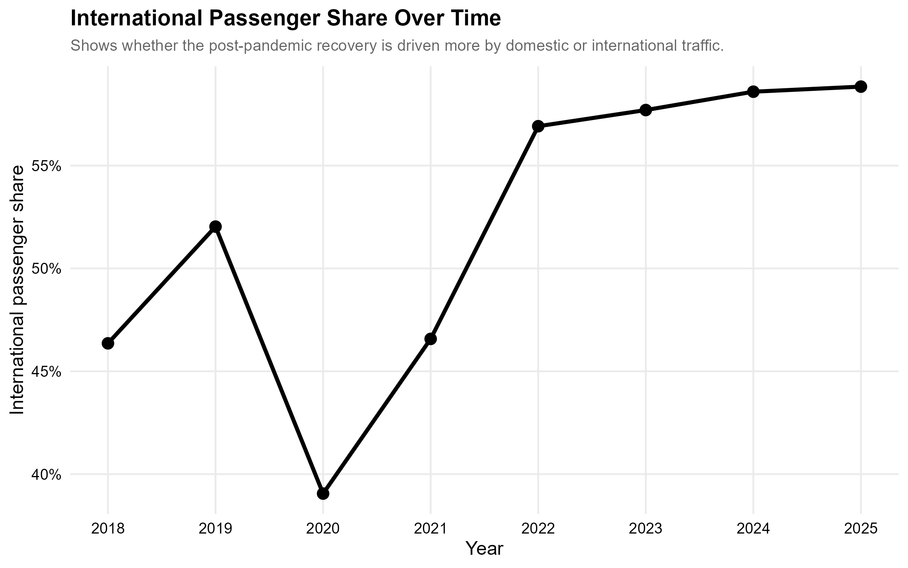{#fig-int-share width="90%"}

The international passenger share dropped in 2020 but increased strongly after 2021. In 2019, international passengers represented around 52% of total passenger traffic. By 2025, this value reached almost 59%. This suggests that the post-pandemic recovery was strongly supported by international traffic.

<details>

<summary>Show R code for this plot</summary>

``` r
international_share <- df_passenger |>
  rename(
    domestic = 2,
    international = 3,
    total = 4
  ) |>
  group_by(year) |>
  summarise(
    total_international = sum(international, na.rm = TRUE),
    total_passenger = sum(total, na.rm = TRUE),
    .groups = "drop"
  ) |>
  mutate(international_share = total_international / total_passenger)

p_int_share <- ggplot(
  international_share,
  aes(x = year, y = international_share)
) +
  geom_line(linewidth = 1.2, color = "black") +
  geom_point(size = 3, color = "black") +
  scale_y_continuous(labels = percent) +
  scale_x_continuous(breaks = 2018:2025) +
  labs(
    title = "International Passenger Share Over Time",
    subtitle = "Shows whether the post-pandemic recovery is driven more by domestic or international traffic.",
    x = "Year",
    y = "International passenger share"
  )

ggsave(
  "results/02_international_passenger_share.png",
  p_int_share,
  width = 9,
  height = 6,
  dpi = 300
)
```

</details>

Passenger per commercial flight was used as a proxy for operational intensity.

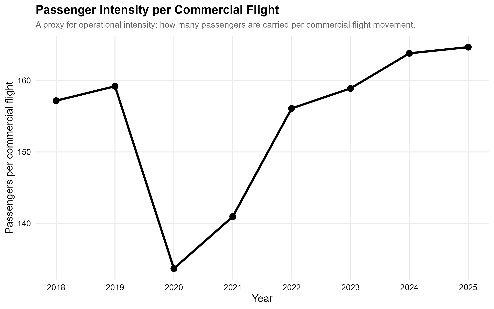{#fig-pass-per-flight width="90%"}

Passenger per commercial flight decreased during 2020 because aircraft utilization and travel demand were disrupted during the pandemic. After 2021, the indicator recovered and continued increasing. By 2025, the network carried more passengers per commercial flight than before the pandemic.

<details>

<summary>Show R code for this plot</summary>

``` r
national_passenger <- df_passenger |>
  rename(total_passenger = 4) |>
  group_by(year) |>
  summarise(total_passenger = sum(total_passenger, na.rm = TRUE), .groups = "drop")

national_commercial <- df_commercial |>
  rename(total_commercial = 4) |>
  group_by(year) |>
  summarise(total_commercial = sum(total_commercial, na.rm = TRUE), .groups = "drop")

passenger_per_flight <- national_passenger |>
  left_join(national_commercial, by = "year") |>
  mutate(passenger_per_commercial_flight = total_passenger / total_commercial)

p_passenger_per_flight <- ggplot(
  passenger_per_flight,
  aes(x = year, y = passenger_per_commercial_flight)
) +
  geom_line(linewidth = 1.2, color = "black") +
  geom_point(size = 3, color = "black") +
  scale_x_continuous(breaks = 2018:2025) +
  labs(
    title = "Passenger Intensity per Commercial Flight",
    subtitle = "A proxy for operational intensity.",
    x = "Year",
    y = "Passengers per commercial flight"
  )

ggsave(
  "results/05_passenger_per_commercial_flight_trend.png",
  p_passenger_per_flight,
  width = 9,
  height = 6,
  dpi = 300
)
```

</details>

The concentration analysis shows how much of the national passenger traffic is handled by the largest airports.

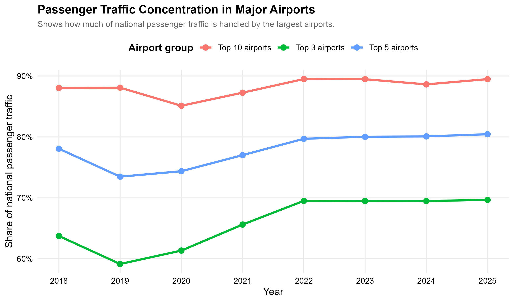{#fig-concentration width="95%"}

The concentration trend shows that the top airports dominate national passenger traffic. In 2025, the top three airports handled nearly 70% of total passenger traffic, while the top five handled around 80%. The top ten airports handled almost 90% of all passenger traffic. This means that Turkey's aviation network is operationally broad but demand is highly concentrated in major hubs and tourism airports.

<details>

<summary>Show R code for this plot</summary>

``` r
concentration_data <- df_passenger |>
  rename(
    airport = 1,
    total = 4
  ) |>
  group_by(year) |>
  arrange(desc(total), .by_group = TRUE) |>
  mutate(
    national_total = sum(total, na.rm = TRUE),
    rank = row_number()
  ) |>
  summarise(
    `Top 3 airports` = sum(total[rank <= 3], na.rm = TRUE) / first(national_total),
    `Top 5 airports` = sum(total[rank <= 5], na.rm = TRUE) / first(national_total),
    `Top 10 airports` = sum(total[rank <= 10], na.rm = TRUE) / first(national_total),
    .groups = "drop"
  ) |>
  tidyr::pivot_longer(
    cols = -year,
    names_to = "airport_group",
    values_to = "share"
  )

p_concentration <- ggplot(
  concentration_data,
  aes(x = year, y = share, color = airport_group)
) +
  geom_line(linewidth = 1.2) +
  geom_point(size = 3) +
  scale_y_continuous(labels = percent) +
  scale_x_continuous(breaks = 2018:2025) +
  labs(
    title = "Passenger Traffic Concentration in Major Airports",
    subtitle = "Shows how much of national passenger traffic is handled by the largest airports.",
    x = "Year",
    y = "Share of national passenger traffic",
    color = "Airport group"
  )

ggsave(
  "results/04_airport_concentration_trend.png",
  p_concentration,
  width = 10,
  height = 6,
  dpi = 300
)
```

</details>

## 3.3 Model Fitting and Performance Indicators

This project uses an indicator-based benchmarking approach rather than a complex predictive model. The main goal is not to forecast future demand, but to compare airports and identify operational patterns. Therefore, several performance indicators were calculated.

The main indicators are:

$$
\text{Passenger per Commercial Flight} =
\frac{\text{Total Passengers}}{\text{Commercial Flight Movements}}
$$

$$
\text{Passenger Intensity per 1,000 Residents} =
\frac{\text{Total Passengers}}{\text{Province Population}} \times 1000
$$

$$
\text{International Passenger Share} =
\frac{\text{International Passengers}}{\text{Total Passengers}}
$$

$$
\text{Cargo Specialization} =
\frac{\text{Cargo Tonnage}}{\text{Total Passengers}} \times 1000
$$

These indicators were used to benchmark airports from different perspectives. Passenger per commercial flight measures operational intensity. Passenger per 1,000 residents shows how much air traffic is generated relative to the local population. International passenger share shows whether an airport is more internationally oriented. Cargo specialization shows whether an airport has a stronger logistics role relative to passenger traffic.

The passenger intensity map is one of the most important outputs of the project.

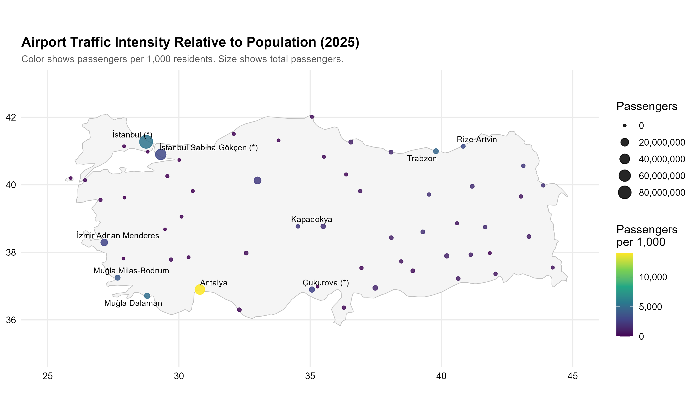{#fig-percapita-map width="95%"}

This map shows that Antalya has the highest passenger intensity relative to population. Istanbul, Muğla airports, Trabzon, Rize-Artvin, and some tourism or regional connection points also have high values. This does not directly mean that these airports are more efficient in a technical sense. A better interpretation is that these airports attract high passenger traffic compared to their local population, mostly due to tourism, hub effects, or regional accessibility.

<details>

<summary>Show R code for this plot</summary>

``` r
p_percapita_map <- ggplot() +
  geom_polygon(
    data = turkey_map,
    aes(x = long, y = lat, group = group),
    fill = "gray96",
    color = "gray75",
    linewidth = 0.3
  ) +
  geom_point(
    data = map_df |> filter(!is.na(lat), !is.na(lon), !is.na(passenger_per_1000)),
    aes(x = lon, y = lat, color = passenger_per_1000, size = total),
    alpha = 0.85
  ) +
  geom_text_repel(
    data = map_df |>
      filter(!is.na(lat), !is.na(lon), !is.na(passenger_per_1000)) |>
      slice_max(passenger_per_1000, n = 10),
    aes(x = lon, y = lat, label = airport),
    size = 3,
    max.overlaps = 20
  ) +
  scale_color_viridis_c(labels = comma) +
  scale_size_continuous(labels = comma) +
  coord_quickmap(xlim = c(25, 45), ylim = c(35, 43)) +
  labs(
    title = "Airport Traffic Intensity Relative to Population (2025)",
    subtitle = "Color shows passengers per 1,000 residents. Size shows total passengers.",
    x = NULL,
    y = NULL,
    color = "Passengers\nper 1,000",
    size = "Passengers"
  )

ggsave(
  "results/plot_02_passenger_per_1000_population_map_2025.png",
  p_percapita_map,
  width = 10,
  height = 6,
  dpi = 300
)
```

</details>

The same result can be seen more clearly in the ranking chart.

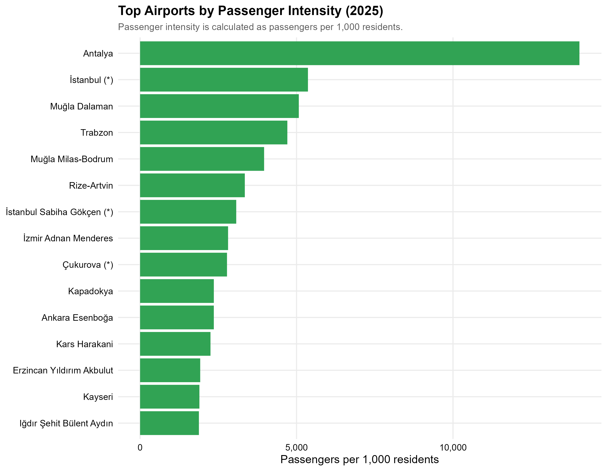{#fig-top-intensity width="95%"}

Antalya appears as the strongest airport in passenger intensity. Istanbul Airport, Muğla Dalaman, Trabzon, Muğla Milas-Bodrum, and Rize-Artvin also rank high. This supports the idea that airport demand is not only related to local population size. Tourism and airport network role are also important.

<details>

<summary>Show R code for this plot</summary>

``` r
top_intensity <- map_df |>
  filter(!is.na(passenger_per_1000), total > 0) |>
  arrange(desc(passenger_per_1000)) |>
  slice_head(n = 15)

p_top_intensity <- ggplot(
  top_intensity,
  aes(x = reorder(airport, passenger_per_1000), y = passenger_per_1000)
) +
  geom_col(fill = "#31a354") +
  coord_flip() +
  scale_y_continuous(labels = comma) +
  labs(
    title = "Top Airports by Passenger Intensity (2025)",
    subtitle = "Passenger intensity is calculated as passengers per 1,000 residents.",
    x = NULL,
    y = "Passengers per 1,000 residents"
  )

ggsave(
  "results/plot_03_top_airports_passenger_intensity_2025.png",
  p_top_intensity,
  width = 9,
  height = 7,
  dpi = 300
)
```

</details>

Airport growth was also analyzed by comparing 2025 passenger traffic with 2019 passenger traffic.

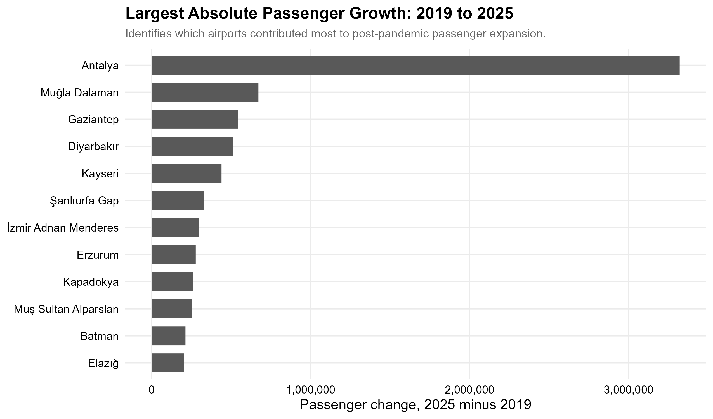{#fig-growth width="95%"}

The largest absolute passenger growth occurred in Antalya, followed by Muğla Dalaman, Gaziantep, Diyarbakır, and Kayseri. This suggests that post-pandemic expansion was not limited to Istanbul. Tourism-oriented airports and some regional airports also contributed to passenger growth.

<details>

<summary>Show R code for this plot</summary>

``` r
passenger_2019 <- df_passenger |>
  filter(year == 2019) |>
  rename(
    airport = 1,
    total_2019 = 4
  ) |>
  mutate(airport_clean = clean_text(airport)) |>
  select(airport_clean, total_2019)

growth_df <- passenger_2025 |>
  select(airport, airport_clean, total) |>
  left_join(passenger_2019, by = "airport_clean") |>
  mutate(passenger_change = total - total_2019) |>
  filter(!is.na(passenger_change)) |>
  arrange(desc(passenger_change)) |>
  slice_head(n = 12)

p_growth <- ggplot(
  growth_df,
  aes(x = reorder(airport, passenger_change), y = passenger_change)
) +
  geom_col(fill = "gray35") +
  coord_flip() +
  scale_y_continuous(labels = comma) +
  labs(
    title = "Largest Absolute Passenger Growth: 2019 to 2025",
    subtitle = "Identifies which airports contributed most to post-pandemic passenger expansion.",
    x = NULL,
    y = "Passenger change, 2025 minus 2019"
  )

ggsave(
  "results/08_largest_passenger_growth_2019_2025.png",
  p_growth,
  width = 9,
  height = 7,
  dpi = 300
)
```

</details>

Cargo specialization was analyzed separately because cargo and passenger traffic may behave differently.

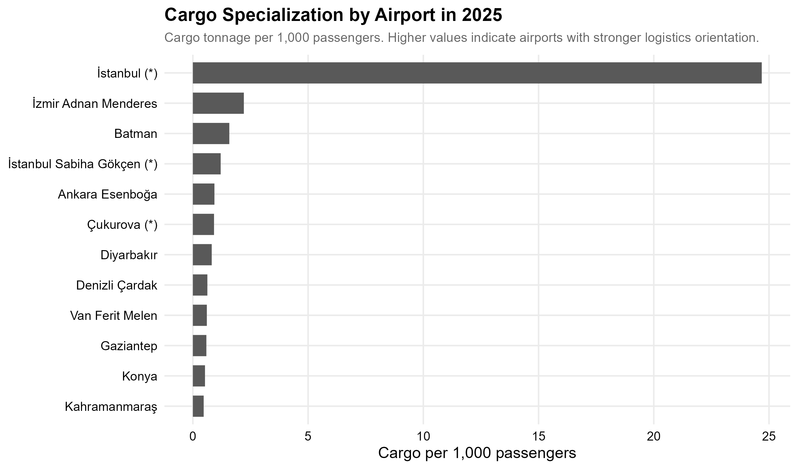{#fig-cargo-specialization width="95%"}

Istanbul Airport stands out strongly in cargo specialization. This result is consistent with its role as a major international hub. Some other airports also show cargo activity relative to passenger volume, but the difference between Istanbul and the rest of the network is very large. This indicates that cargo logistics activity is much more centralized than passenger traffic.

<details>

<summary>Show R code for this plot</summary>

``` r
cargo_2025 <- df_cargo |>
  filter(year == 2025) |>
  rename(
    airport = 1,
    cargo_total = 4
  ) |>
  mutate(airport_clean = clean_text(airport)) |>
  select(airport_clean, cargo_total)

cargo_specialization <- passenger_2025 |>
  select(airport, airport_clean, total) |>
  left_join(cargo_2025, by = "airport_clean") |>
  mutate(cargo_per_1000_passengers = cargo_total / total * 1000) |>
  filter(!is.na(cargo_per_1000_passengers), total > 0) |>
  arrange(desc(cargo_per_1000_passengers)) |>
  slice_head(n = 12)

p_cargo_specialization <- ggplot(
  cargo_specialization,
  aes(x = reorder(airport, cargo_per_1000_passengers),
      y = cargo_per_1000_passengers)
) +
  geom_col(fill = "gray35") +
  coord_flip() +
  labs(
    title = "Cargo Specialization by Airport in 2025",
    subtitle = "Cargo tonnage per 1,000 passengers.",
    x = NULL,
    y = "Cargo per 1,000 passengers"
  )

ggsave(
  "results/09_cargo_specialization_2025.png",
  p_cargo_specialization,
  width = 9,
  height = 7,
  dpi = 300
)
```

</details>

Finally, the 2023 earthquake period was analyzed using non-commercial flight movements as a proxy for extraordinary emergency and logistics activity.

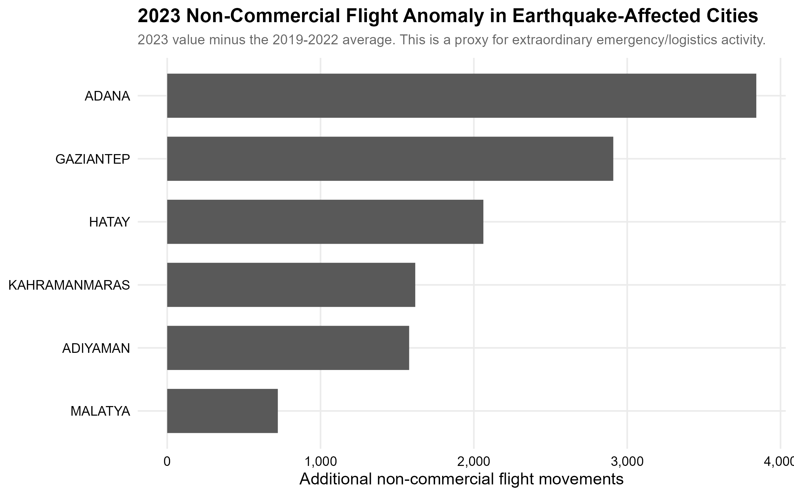{#fig-earthquake width="95%"}

The anomaly chart compares 2023 non-commercial flights with the 2019--2022 average in earthquake-affected cities. Adana, Gaziantep, Hatay, Kahramanmaraş, Adıyaman, and Malatya show visible increases. This does not prove that all additional non-commercial flights were emergency flights, but it provides a useful proxy for extraordinary logistics, relief, military, or support activity during the disaster period.

<details>

<summary>Show R code for this plot</summary>

``` r
clean_city_names <- function(df) {
  df |>
    rename(airport = 1) |>
    mutate(city = sub(" .*$", "", toupper(airport))) |>
    mutate(city = stringi::stri_trans_general(city, "Latin-ASCII")) |>
    mutate(city = toupper(city))
}

target_cities <- c("ADANA", "GAZIANTEP", "KAHRAMANMARAS",
                   "HATAY", "ADIYAMAN", "MALATYA")

eq_comm <- df_commercial |>
  clean_city_names() |>
  filter(city %in% target_cities) |>
  rename(total_commercial = 4) |>
  group_by(year, city) |>
  summarise(commercial = sum(total_commercial, na.rm = TRUE), .groups = "drop")

eq_all <- df_all_plane |>
  clean_city_names() |>
  filter(city %in% target_cities) |>
  rename(total_all = 4) |>
  group_by(year, city) |>
  summarise(all_plane = sum(total_all, na.rm = TRUE), .groups = "drop")

eq_anomaly <- eq_all |>
  left_join(eq_comm, by = c("year", "city")) |>
  mutate(non_commercial = all_plane - commercial) |>
  group_by(city) |>
  summarise(
    baseline_avg = mean(non_commercial[year %in% 2019:2022], na.rm = TRUE),
    value_2023 = non_commercial[year == 2023],
    anomaly = value_2023 - baseline_avg,
    .groups = "drop"
  ) |>
  arrange(desc(anomaly))

p_eq_anomaly <- ggplot(
  eq_anomaly,
  aes(x = reorder(city, anomaly), y = anomaly)
) +
  geom_col(fill = "gray35") +
  coord_flip() +
  scale_y_continuous(labels = comma) +
  labs(
    title = "2023 Non-Commercial Flight Anomaly in Earthquake-Affected Cities",
    subtitle = "2023 value minus the 2019-2022 average.",
    x = NULL,
    y = "Additional non-commercial flight movements"
  )

ggsave(
  "results/10_earthquake_noncommercial_anomaly_2023.png",
  p_eq_anomaly,
  width = 9,
  height = 6,
  dpi = 300
)
```

</details>

## 3.4 Results

The analysis provides several important findings:

-   The aviation network experienced a severe passenger traffic collapse in 2020 due to COVID-19.
-   Cargo traffic was more resilient than passenger traffic during the pandemic.
-   By 2025, passenger traffic, cargo traffic, freight, commercial flights, and all-plane movements had exceeded their 2019 baseline values.
-   International passenger traffic became more important after the pandemic.
-   Passenger traffic is highly concentrated in a small number of airports.
-   Antalya, Istanbul, and Muğla airports show very strong passenger intensity relative to population.
-   Istanbul Airport dominates both passenger traffic and cargo specialization.
-   Non-commercial flight anomalies in 2023 show unusual activity in earthquake-affected cities.

# 4. Results and Key Takeaways

This project shows that Turkey's national aviation network recovered strongly after the COVID-19 shock, but the recovery was not uniform across all activity types. Passenger traffic fell sharply in 2020, while cargo traffic remained much more stable. After 2021, the recovery accelerated, and by 2025 most aviation indicators were above their 2019 levels.

Another important finding is the high concentration of passenger traffic. The top three airports handled almost 70% of total passenger traffic in 2025. This shows that Turkey has many airports geographically, but demand is still dominated by a few major hubs and tourism airports.

The passenger per capita analysis shows that population alone does not explain airport traffic. Antalya and Muğla airports have very high passenger intensity because they serve tourism demand in addition to local residents. Istanbul also has high intensity because of its hub function and international connectivity.

From an Industrial Engineering perspective, the results are useful for understanding network-level demand distribution, capacity pressure, regional airport roles, and logistics orientation. The findings suggest that airport planning should consider not only local population but also tourism, hub effects, cargo specialization, and extraordinary events such as disasters.

## Limitations

There are some limitations in this study. First, the analysis mainly uses annual data, so monthly seasonality cannot be evaluated in detail. Second, passenger per capita and passenger per flight are proxy indicators; they do not measure technical airport efficiency directly. Third, non-commercial flight movements are used as a proxy for emergency activity, but this category may include military, private, cargo, training, or other non-commercial flights.

## Conclusion

Overall, the study demonstrates that Turkey's aviation network is highly dynamic and strongly affected by global disruptions, tourism demand, hub structure, and logistics activity. The results show a clear post-pandemic recovery, increasing international passenger importance, high traffic concentration in major airports, and strong regional differences in airport traffic intensity.
